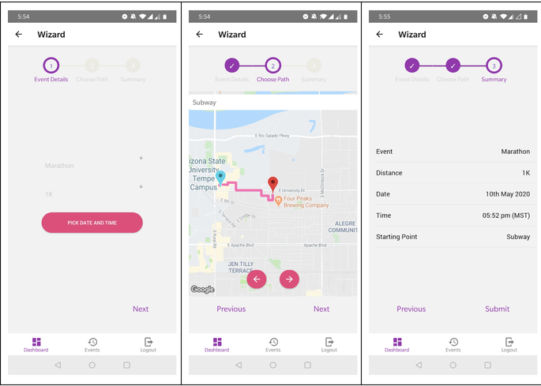
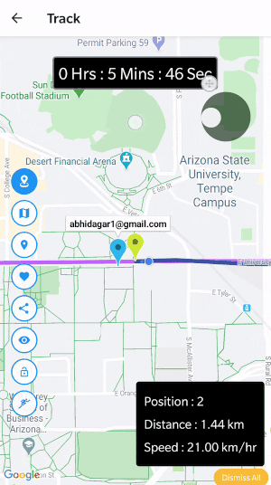

# FitBoard
Real Time Marathon/Cyclathon tracking application

## Features
### Creating Events

### Event Registration

### Real Time Multiplayer Event Tracking

### Event Registration

### Event Registration

## Setup Instructions
- Install node.js and Npm by following these instructions depending on your operating system. (Downloading and installing Node.js and npm)
- Since the application uses react-native environment, that needs to be set up first.
- Unzip the code file and navigate to the root folder, then run npm install, this would install all the required node modules mentioned in the package.json file.
- In the root folder run react-native eject which will generate the android and ios folders.
- In order to run the app we’ll need to setup android studio as well as mentioned in https://developers.facebook.com/docs/react-native/configure-android/.
- Enable the Directions, Places, Distance Matrix, Geocoding, Maps SDK for Android Google API from the Google Cloud Console.
- Configure the Google API Key in the Android Manifest File.(Get an API Key | Maps SDK for Android)
- Since Firebase is needed, we need to create an Android firebase project and insert the google-services.json file in the $PATH_TO_PROJECT/android/app folder
- Refer to https://rnfirebase.io/ to set up firebase for android and IOS.
- After android setup is done, run npm run android  command, this would then start building the code and if you are using an android emulator, that will be opened or if you are making use of you phone (with USB debugging enabled) app will be opened on your phone.
- After creating an account and logging into it, you will be able to make use of the app.
